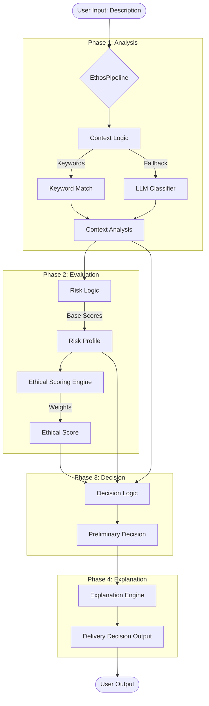

# ETHOS-DELIVER: Ethical Priority System Documentation

## 1. System Overview
**ETHOS-DELIVER** is an intelligent logistics prioritization system designed to make ethical delivery decisions. It evaluates package descriptions to determine shipping priority based on urgency, domain analysis (e.g., Medical, Emergency), and ethical risk profiles.

The system employs a **Neuro-Symbolic** approach:
*   **Symbolic Logic**: Keyword mapping and deterministic rule sets for known, high-stakes domains (Medical, Emergency).
*   **Neural Logic** (Fallback): Uses a Large Language Model (LLM) via Hugging Face to classify ambiguous inputs that symbolic rules miss.

## 2. Architecture

The system follows a linear pipeline architecture orchestrated by the `EthosPipeline` class.



## 3. Core Components

### 3.1 Data Models (`src/models.py`)
Standardized data structures used throughout the pipeline.
*   **`DeliveryInput`**: Raw input (description, locations).
*   **`ContextAnalysis`**: Result of domain classification (Medical, Emergency, Essential, General).
*   **`RiskProfile`**: Numerical assessment (0-10) of *Harm*, *Vulnerability*, and *Time Sensitivity*.
*   **`EthicalScore`**: Weighted aggregate score used for thresholding.
*   **`DeliveryDecision`**: Final output containing priority level (1=Critical, 2=High, 3=Normal), approval requirements, and explanation.

### 3.2 Context Analysis (`src/logic.py` -> `ContextLogic`)
Determines the domain of the package.
1.  **Keyword Matching**: Checks `package_description` against `DOMAIN_KEYWORDS` in `knowledge_base.py`.
    *   *Priority*: Medical > Emergency > Essential > General.
2.  **LLM Fallback**: If no keywords match, invokes `LLMClient` (`src/llm_client.py`).
    *   Uses Hugging Face Zero-Shot Classification (`facebook/bart-large-mnli`).
    *   Labels: MEDICAL, EMERGENCY, ESSENTIAL, GENERAL.

### 3.3 Risk & Ethical Scoring (`src/logic.py`)
*   **`RiskLogic`**: Maps the determined `DomainCategory` to base risk scores defined in `RISK_BASE_SCORES`.
    *   *Example*: Medical -> Harm(9), Vuln(9), Time(8).
*   **`EthicalScoringEngine`**: Calculates `total_score` using configurable `WEIGHTS`.
    *   Formula: $Score = (Harm \times 0.4) + (Vulnerability \times 0.35) + (Time \times 0.25)$

### 3.4 Decision Engine (`src/logic.py` -> `DecisionLogic`)
Maps the `total_score` to a Priority Level using `PRIORITY_THRESHOLDS`.
*   **Priority 1 (Critical)**: Score $\ge$ 8.0 (Requires Human Approval).
*   **Priority 2 (High)**: Score $\ge$ 6.0.
*   **Priority 3 (Normal)**: Score < 6.0.

### 3.5 Explanation Engine (`src/explanation.py`)
Generates a human-readable justification for the decision, citing specific risk calculations and context factors.

## 4. Configuration (`src/knowledge_base.py`)
The system behavior is data-driven and defined in `src/knowledge_base.py`. You can tune the system by modifying:
*   **`DOMAIN_KEYWORDS`**: Add new terms to trigger specific domains manually.
*   **`RISK_BASE_SCORES`**: Adjust the default risk profile for each domain.
*   **`WEIGHTS`**: Change the importance of Harm vs. Time vs. Vulnerability.
*   **`PRIORITY_THRESHOLDS`**: Adjust the scores required to trigger P1 or P2 status.

## 5. Installation & Usage

### Prerequisites
*   Python 3.x
*   `.env` file with `HUGGINGFACE_API_KEY` (for LLM fallback).

### Dependencies
```bash
pip install huggingface_hub python-dotenv
```

### Running the System
**Interactive CLI Mode**:
```bash
python main.py
```
*Enter package descriptions when prompted. Type 'q' to exit.*

**Single Command Mode**:
```bash
python main.py "Box of insulin pens for urgent delivery"
```

## 6. Testing
*   **`test_zero_shot.py`**: Validates the integration with Hugging Face API.
*   **`test_hf_models.py`**: Tests compatibility of different HF models.
